# Discover Dollar MEAN Stack Application
Dockerized + GitHub Actions CI/CD

## Project Overview

This is a fully functional CRUD MEAN Stack Application (MongoDB + Express + Angular + Node.js) containerized using Docker and orchestrated using Docker Compose.
A CI/CD pipeline using GitHub Actions is configured to automatically:
Build the frontend & backend
Create Docker images
Push them to Docker Hub
Since cloud access was unavailable during execution, the deployment was fully done locally using Docker Compose, and CI/CD pushed images to Docker Hub successfully.

## 🛠 Technologies Used
Component	Technology
Frontend	    Angular
Backend	      Node.js + Express
Database    	MongoDB
DevOps	      Docker, Docker Compose
CI/CD	        GitHub Actions
Registry    	Docker Hub

## ⚙️ Setup & Run (Local Machine)
1. create a repo
   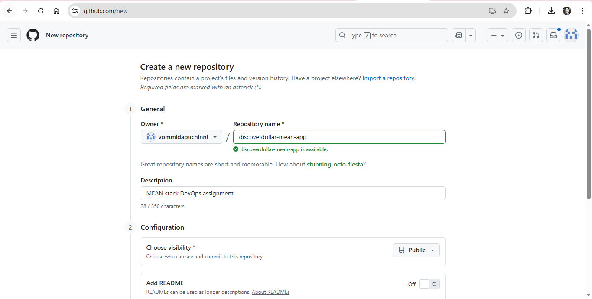
2. Copy project files to repo folder: cp -r ../crud-dd-task-mean-app/crud-dd-task-mean-app/* .
3. Verify files are copied: ls
4. we see backend and frontend folders
5. create docker files for both frontend and backend
6. in root folder create docker compose yaml files
7. run the command: docker-compose up -d
8. we see images pulled and containers created
9. using docker ps we see
frontend - running
backend  - running
mongo    - running

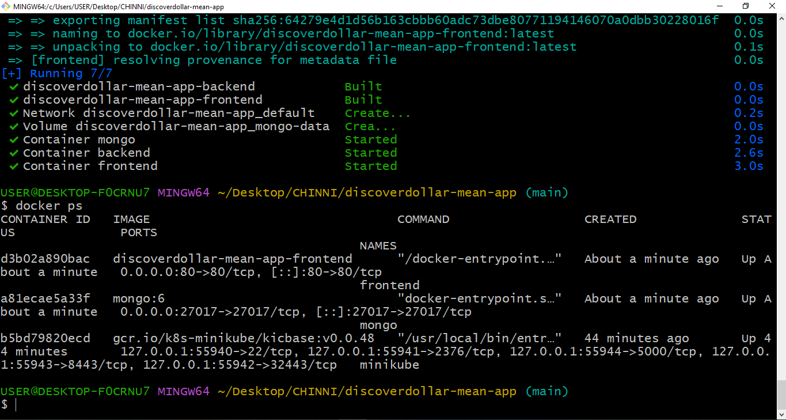

## 🌍 Access Application
Service	URL
Frontend	http://localhost

Backend API	http://localhost:8080/api

MongoDB	localhost:27017

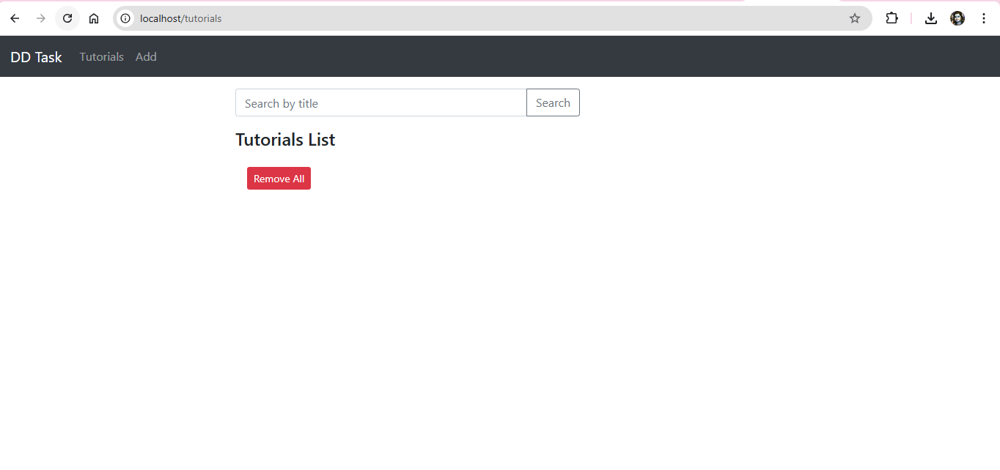

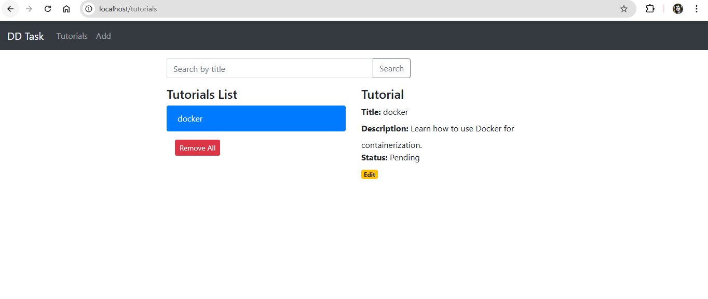
## 🧪 Testing Frontend-Backend Integration

Open browser → http://localhost
Create, update or delete tutorials.
The backend responds with live data from MongoDB.
we can see logs for both forntend and backend

## CI/CD Pipeline

This project uses GitHub Actions: .github/workflows/ci-cd.yml

Pipeline Steps:
Step	Action
🧱 Build	 →  Build frontend & backend
🔍 Test  →  	Validate build
📦 Package	 →  Create Docker images
📤 Deploy	 →  Push images to Docker Hub

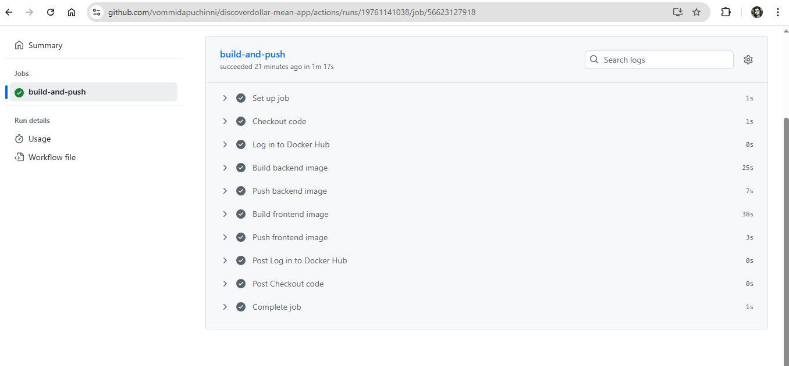

after that pull docker images from docker hub and run on we see the containers are running and accessed.
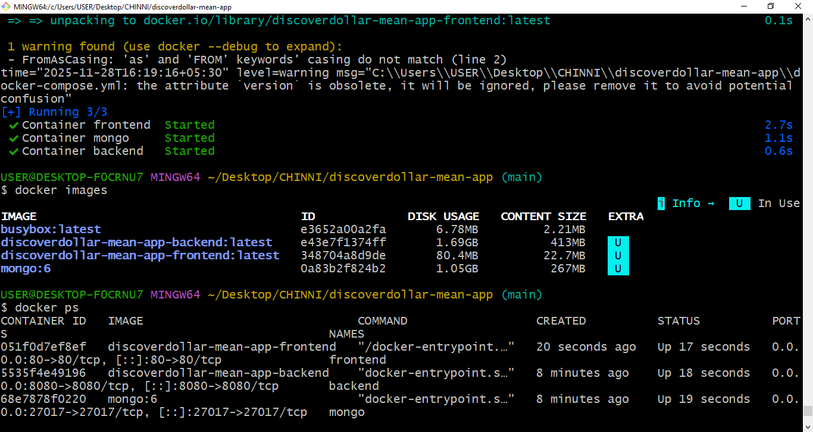

## output

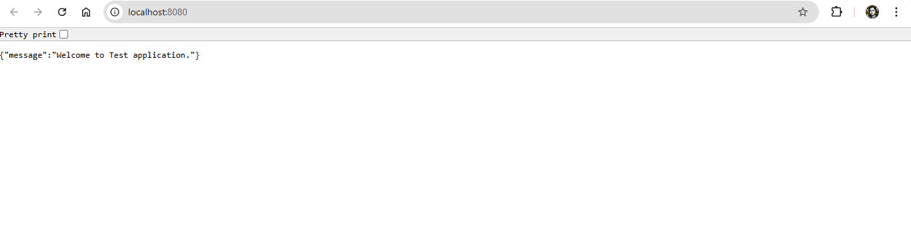
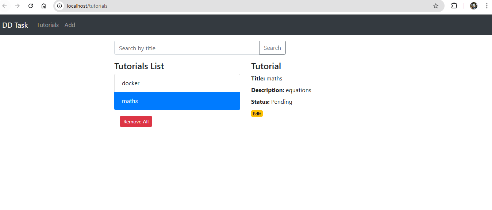

## Docker Hub Images
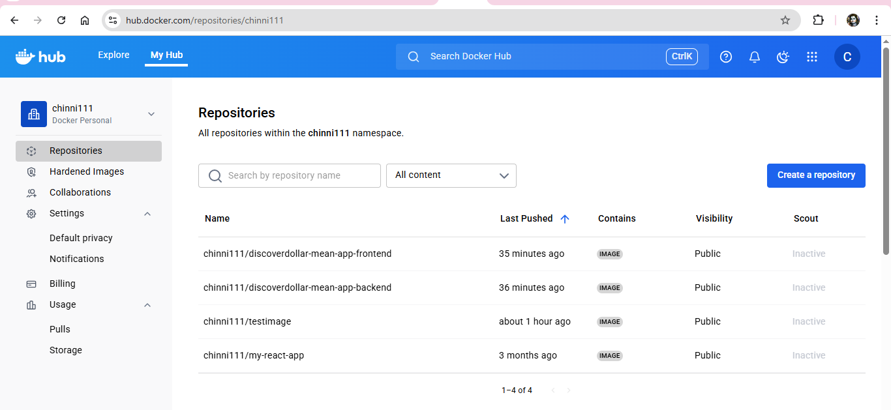
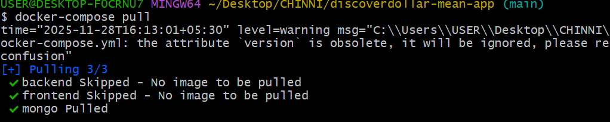

## logs
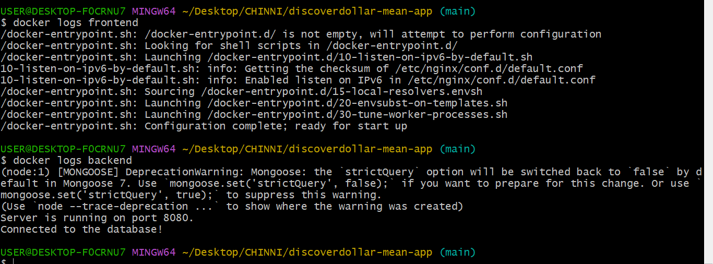

## Cleanup Commands
Stop and remove containers: docker-compose down

Delete images: docker rmi discoverdollar-mean-app-frontend discoverdollar-mean-app-backend
